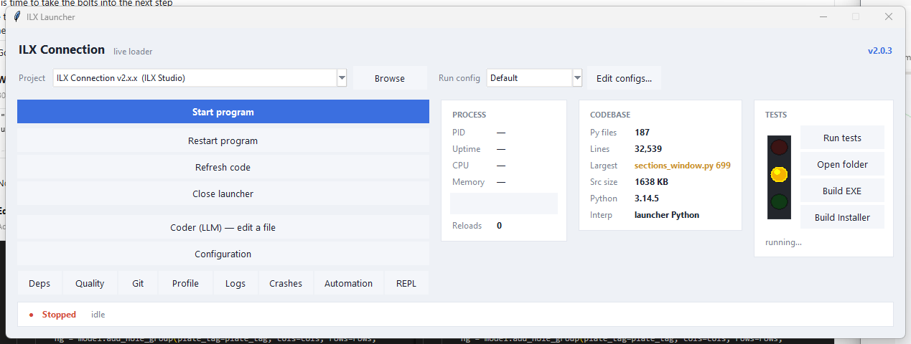
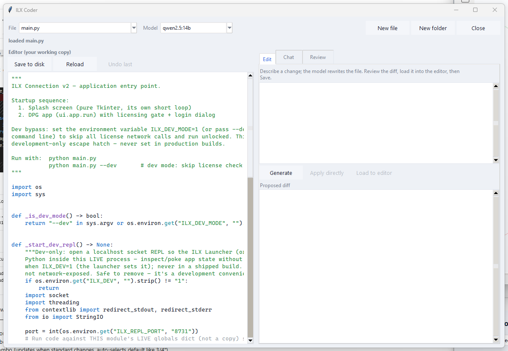
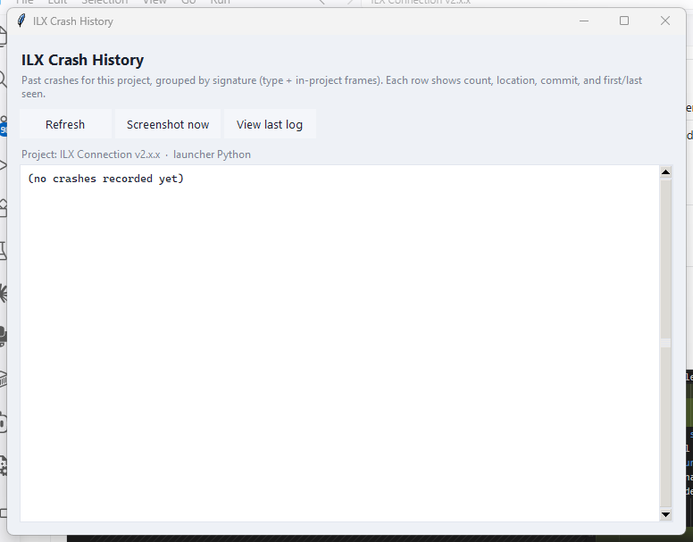
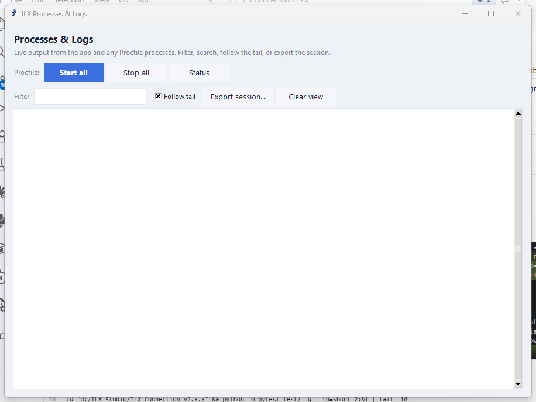
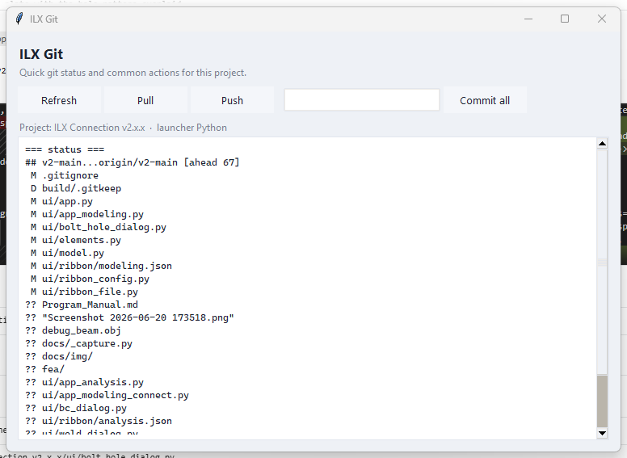

# ILX Launcher

**A developer cockpit for running, hot-reloading, testing, and shipping Python desktop apps.**

[](https://github.com/allaint/ILX-Launcher/actions/workflows/ci.yml)
[](LICENSE)
[](https://python.org)

Point it at any project with a `main.py`. It runs your app as a child process, watches source files, hot-patches live edits, captures crashes, manages interpreters and dependencies, builds an EXE, and gives you a local-LLM coding assistant — all from one window that stays open while you work.



> **One window. Start, reload, test, debug, build, ship — without ever touching a terminal.**

---

## The problem it solves

Running a Python desktop app while you develop usually means:

- A terminal you keep switching to and from
- A manual restart on every edit (even a one-liner)
- Separate windows for pip, tests, profiling, and builds
- Tracebacks in one of five terminal windows — you're not sure which
- No safety net when a memory leak or infinite loop runs away with your machine

The ILX Launcher folds all of that into one persistent window.

---

## Quick start

```bash
git clone https://github.com/allaint/ILX-Launcher
cd ILX-Launcher
python main.py
```

No install step. No third-party dependencies. Just Python 3.11+ with tkinter.

> **Windows EXE** — build a standalone `launcher.exe` from inside the launcher (Build EXE button), or:
> ```bash
> pip install pyinstaller
> pyinstaller --onefile --windowed --name launcher main.py
> ```

---

## Features

| Feature | What it does |
|---|---|
| **Start / Restart / Refresh** | Run `main.py` as a child process; restart or hot-reload on save |
| **Hot patch** | Live function reload via [jurigged](https://github.com/breuleux/jurigged) — app state preserved |
| **Coder (LLM)** | Syntax-highlighted editor + Ollama Chat / Review / Edit workspace |
| **Interpreters** | Per-project Python, one-click `.venv`, bundled CPython on demand |
| **Dependencies** | pip console targeting the project interpreter |
| **Tests** | Traffic light that re-runs your suite on every source change |
| **Build EXE** | PyInstaller one-folder or one-file build + Inno Setup installer |
| **Logs** | Live filterable output; Procfile process groups |
| **Crash history** | SQLite grouping; "jump to crash" opens the file at the line |
| **Profiler** | cProfile run-through + live py-spy stack dump |
| **Quality** | ruff / black / mypy via the project interpreter |
| **Git** | Status, commit, pull, push without leaving the launcher |
| **Automation** | Scaffold new projects, test matrix, quality gate, coverage, SQLite browser |
| **Watchdog** | Auto-kills a runaway child on hard memory cap, runaway growth, or pegged CPU |
| **Live REPL** | Run Python inside the *running* app to inspect live state |

---

## Screenshots

| Coder (LLM workspace) | Crash history |
|---|---|
|  |  |

| Logs + Procfile | Git |
|---|---|
|  |  |

---

## Requirements

- Python 3.11+ with tkinter (ships with python.org installer on Windows/macOS; `sudo apt install python3-tk` on some Linux)
- No third-party runtime dependencies in the launcher itself — pure stdlib + tkinter
- Optional tools (hot patch, builds, lint, profiling, LLM) install into the *target project's* interpreter on demand
- LLM features need a local [Ollama](https://ollama.com) server (optional)

---

## Project layout

```
main.py                # entry point (~50 lines, dispatches to ui/)
version.py             # VERSION = "1.1.0"
core/
  state.py             # all shared globals
  config.py            # load/save settings
  interpreter.py       # Python resolution; fork-bomb guard
  process.py           # child process, watchdog, crash DB, hot-patch
  build.py             # PyInstaller + Inno Setup
  coder.py             # LLM edit/chat/review engine
  automation.py        # tests, quality, scaffold, SQLite, matrix
  ollama.py            # streaming Ollama client
  repl.py              # live REPL socket
  notifications.py     # Windows tray balloon
  diagnostics.py       # screenshot, py-spy
ui/
  main_window.py       # launcher main window + tick loop
  coder_window.py      # Coder window
  config_window.py     # Configuration window
  tool_windows.py      # Deps, Quality, Git, Profile, Logs, Crashes, Automation, RunConfigs
  theme.py             # fonts, styles, syntax highlighting, shared widgets
assets/
docs/
  LAUNCHER_MANUAL.md   # full user manual with screenshots
  whitepaper.md        # technical narrative: why we built this
  img/                 # manual screenshots
.github/
  workflows/ci.yml     # smoke-test on push
  ISSUE_TEMPLATE/      # bug report + feature request templates
  PULL_REQUEST_TEMPLATE.md
CONTRIBUTING.md
CHANGELOG.md
requirements.txt       # OPTIONAL tools the launcher drives (not imported by it)
```

---

## Configuration

Settings persist to `~/.ilx_launcher.json` — recent projects, per-project interpreters, run configs, watchdog thresholds, all options. Configuration → Save writes it live.

Per-machine runtime files (`.launcher_crashes.db`, `.launcher_session.log`, `.window_geometry.json`) are git-ignored.

---

## Technical notes

- **Fork-bomb safe when frozen**: `tool_python()` never returns the launcher EXE itself; callers skip rather than spawn.
- **Zero third-party imports in the launcher**: `psutil`, `jurigged`, `requests`, etc. run *inside the target project's interpreter*, not the launcher's.
- **Permissive licenses only**: MIT / BSD / Apache / PSF / OFL. No GPL/LGPL/copyleft — the launcher is part of a sold product.
- **ASCII-only `print()`**: em-dashes and ellipsis crash Windows cp1252 in frozen builds.

See [docs/whitepaper.md](docs/whitepaper.md) for the full technical narrative, and [CONTRIBUTING.md](CONTRIBUTING.md) for the code rules.

---

## License

[MIT](LICENSE) (c) 2026 ILX Studio, LLC
