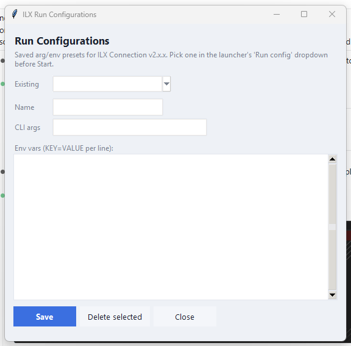
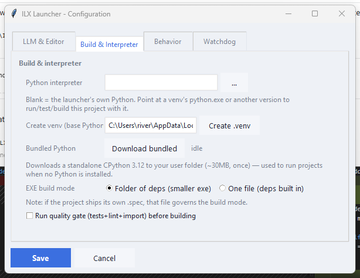
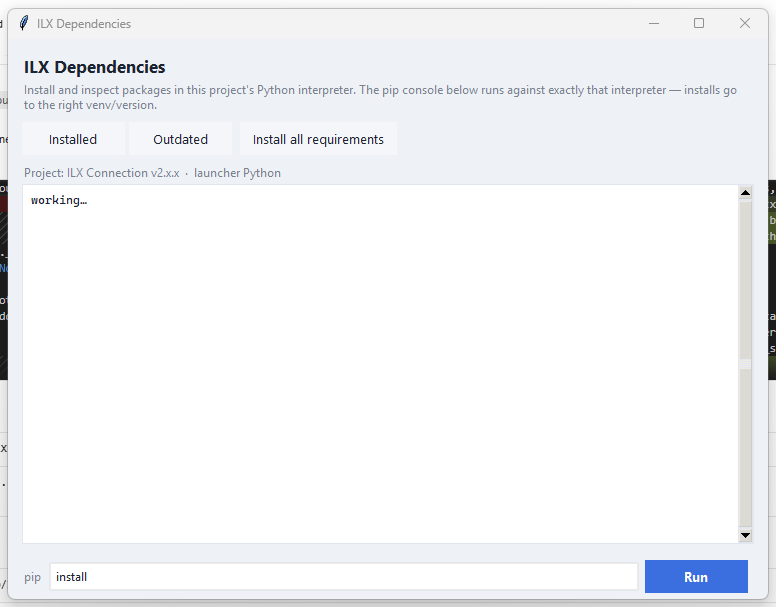
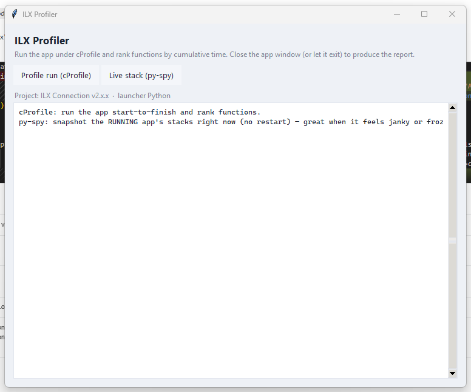
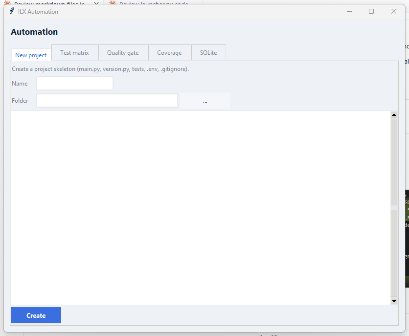
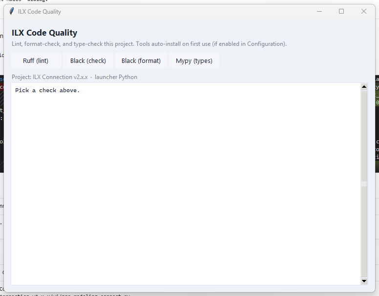
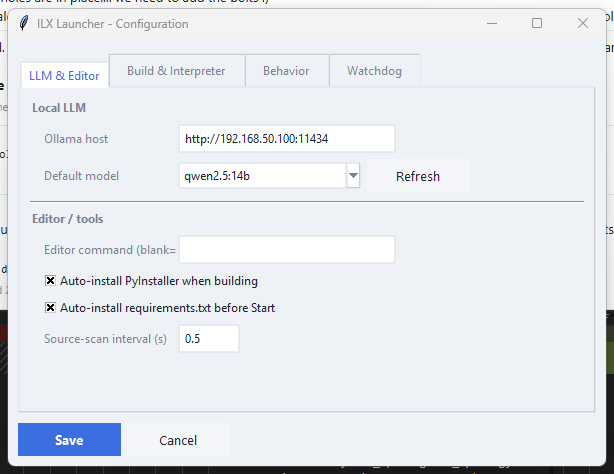
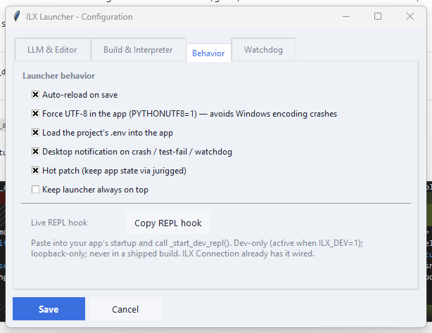
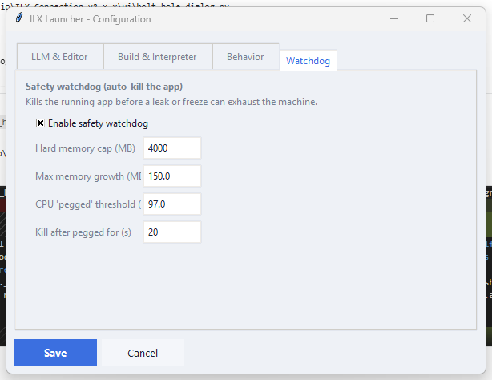

# ILX Launcher — User Manual

The **ILX Launcher** is a developer cockpit for running, reloading, testing, building,
and inspecting Python desktop projects. It runs your app as a child process, watches your
source files, captures crashes, manages dependencies and interpreters, and bundles a
local‑LLM coding assistant — all from one window.

It ships as a single file (`launcher.py`) and can also be frozen to a standalone
`launcher.exe`. It's intentionally product‑agnostic: point it at any project that has a
`main.py` and it works.

---

## Table of contents

1. [Getting started](#getting-started)
2. [The main window](#the-main-window)
3. [Running your app](#running-your-app)
4. [Live reload & hot patch](#live-reload--hot-patch)
5. [Projects & run configurations](#projects--run-configurations)
6. [Python interpreter & virtual environments](#python-interpreter--virtual-environments)
7. [Dependencies (pip)](#dependencies-pip)
8. [Tests & the traffic light](#tests--the-traffic-light)
9. [Building an EXE / installer](#building-an-exe--installer)
10. [The Coder (local LLM)](#the-coder-local-llm)
11. [Tool windows](#tool-windows)
    - [Processes & Logs](#processes--logs)
    - [Crash History](#crash-history)
    - [Profiler](#profiler)
    - [Git](#git)
    - [Automation](#automation)
    - [Live REPL](#live-repl)
12. [Configuration](#configuration)
13. [Safety watchdog](#safety-watchdog)
14. [Tips & troubleshooting](#tips--troubleshooting)

---

## Getting started

**From source:**

```
python launcher.py
```

**As a standalone executable:** double‑click `launcher.exe`. No Python installation is
required — if the machine has no Python, the launcher can download a self‑contained one on
demand (see [Python interpreter](#python-interpreter--virtual-environments)).

The launcher opens on the **last project you used**, or its own folder if it's the first run.

---

## The main window


Everything starts here. The window is organized as:

- **Header** — the active program's name (read live from `version.py`), the "live loader"
  tag, and the program version (top‑right).
- **Project row** — the project picker, **Browse**, the **Run config** dropdown, and
  **Edit configs…**.
- **Action buttons (left)** — Start / Restart / Refresh / Close, plus **Coder** and
  **Configuration**, and a row of tool buttons.
- **PROCESS card** — the running app's PID, uptime, CPU%, memory (with a live sparkline),
  and reload count.
- **CODEBASE card** — file count, lines of code, the largest file (flagged if it nears the
  700‑line "god file" limit), source size, the Python version, and the active interpreter.
- **TESTS card** — a traffic light (red/yellow/green) plus Run tests, Open folder,
  Build EXE, and Build Installer.
- **Status bar (bottom)** — a colored dot + run state, the current activity, and (after a
  crash) an **Open crash** button. Build progress appears here too.

---

## Running your app

| Button | What it does |
|---|---|
| **Start program** | Launches the project's `main.py` as a child process. If "Auto‑install requirements" is on, it installs `requirements.txt` first. |
| **Restart program** | A full close + reopen (always a clean restart, never hot‑patch). |
| **Refresh code** | Relaunches to pick up source edits. |
| **Close launcher** | Stops the app and quits the launcher. |

The child app runs **without a console window**, and its output is captured into the
[Logs](#processes--logs) view and, on a crash, into `log.txt`.

The status bar shows the run state: a **green dot + "Running · pid N"** when up, a **red
dot + "Stopped"** when not, and the exit code when the app closes on its own.

---

## Live reload & hot patch

Two ways to pick up code changes automatically (both configured under
**Configuration → Behavior**):

- **Auto‑reload on save** — when any source file changes, the launcher relaunches the app
  so the new code takes effect. This is a full restart, so app state resets.
- **Hot patch (jurigged)** — runs the app under
  [jurigged](https://github.com/breuleux/jurigged) so edits to *functions* patch into the
  **live** process, preserving state (your loaded project, camera, selection, etc.).
  Structural changes (new classes, changed `__init__`) still need a Restart.

Hot patch requires `jurigged` installed **in the project's interpreter**. If it isn't, the
checkbox is disabled and a one‑click **Install jurigged** button appears next to it.

---

## Projects & run configurations

The launcher can drive **any** project that has a `main.py`:

- **Project dropdown** — switch between recently used projects (remembered across runs).
- **Browse** — pick a new project folder (native folder picker).

**Run configurations** are saved presets of command‑line arguments + environment variables.
Pick one from the **Run config** dropdown before Start, or click **Edit configs…** to
create/edit them. "Default" means no preset (plain launch). This is the launcher's answer to
"I can never remember the command‑line args."



---

## Python interpreter & virtual environments

Each project can run on its **own Python interpreter** — a virtual environment, a different
version, or the bundled runtime. Set this under **Configuration → Build & Interpreter**.



- **Python interpreter** — blank uses the launcher's own Python; otherwise point at a
  `python.exe` (e.g. a venv's). The app, its tests, builds, and dependency tools all run
  with this interpreter.
- **Create .venv** — makes a virtual environment in the project (from a chosen base Python)
  and adopts it as the project's interpreter.
- **Bundled Python** — downloads a self‑contained CPython 3.12 (~30 MB, once) into your user
  folder. Used automatically to run projects when **no Python is installed** — ideal when
  running the frozen `launcher.exe` on a clean machine.

The active interpreter is shown in the CODEBASE card ("Interp").

---

## Dependencies (pip)



The **Deps** tool window manages packages **in the project's interpreter**, so installs
always land in the right place:

- **Installed** / **Outdated** — list packages and what can be upgraded.
- **Install all requirements** — installs `requirements.txt` (and `requirements-dev.txt` /
  `dev-requirements.txt` if present).
- **pip console** — type any pip command (e.g. `install requests`, `uninstall numpy`) and it
  runs against the project interpreter.

With **Auto‑install requirements.txt before Start** enabled (Configuration → LLM & Editor),
the launcher installs missing dependencies automatically when you press Start — so a fresh
project just works.

---

## Tests & the traffic light

The **TESTS** traffic light re‑runs your test suite automatically whenever the source
changes:

- 🟢 **Green** — the last run passed on the current files.
- 🟡 **Yellow** — a run is in progress.
- 🔴 **Red** — the last run found failures (a desktop notification fires on the
  transition to red).

It runs the project's own tests (`test/` or `tests/`) when present; otherwise it falls back
to a built‑in "no god files" architecture guard so the light is still meaningful on a bare
project. Click **Run tests** to trigger a run on demand.

---

## Building an EXE / installer

- **Build EXE** — runs PyInstaller (auto‑installed if missing) and bumps the build number.
- **Build Installer** — builds the EXE, then compiles an Inno Setup installer (generating a
  default `.iss` if the project doesn't ship one), bumping the installer + build numbers.

Choose **one‑folder** (smaller exe + a deps folder) or **one‑file** (single larger exe)
under Configuration → Build & Interpreter. Optionally gate builds behind the quality check
("Run quality gate before building"). Build progress shows in the status bar.

---

## The Coder (local LLM)


The **Coder** is a local‑LLM coding workspace (via [Ollama](https://ollama.com)) with **live
Python syntax highlighting** in an editable code box:

- **Editor (working copy)** — pick a file to load it; edit by hand; **Save to disk** writes
  it (verified — it must compile and pass tests, or it auto‑reverts); **Reload** discards
  edits; **Undo last** restores the previous save.
- **New file / New folder** — create new `.py` files and packages right in the project.
- **Edit tab** — describe a change; the model rewrites the file; review the diff, then
  **Apply directly** (self‑healing: a failed verify is fed back for a retry) or **Load to
  editor** to tweak first.
- **Chat tab** — ask questions about the file (optionally focused on a pasted selection);
  any code block in a reply can be pushed into the editor.
- **Review tab** — the model reviews the file and proposes an improved version, with findings.

Set the Ollama host and default model under Configuration → LLM & Editor.

---

## Tool windows

The tool buttons (Deps / Quality / Git / Profile / Logs / Crashes / Automation / REPL) each
open a focused window.

### Processes & Logs


A live, filterable, follow‑tail view of all captured output (the app plus any orchestrated
processes), with error/warn coloring and source tags. **Export session** saves the log;
**Procfile** orchestration can start/stop a whole group of processes
(`name: command` per line, with optional `[wait tcp:host:port]` startup gates and
auto‑restart on crash).

### Crash History


Every crash is recorded locally (SQLite) with its traceback, timestamp, git commit, and
location — grouped by signature so repeats increment a count. Includes **Screenshot now**
and **View last log**.

### Profiler



- **Profile run (cProfile)** — runs the app start‑to‑finish and ranks functions by
  cumulative time.
- **Live stack (py‑spy)** — snapshots the **running** app's threads without restarting —
  ideal when it feels janky or frozen. (When the safety watchdog kills a CPU‑pegged app, it
  captures a py‑spy dump first so you can see what it was stuck on.)

### Git


Quick `git` status and the common actions — Refresh, Pull, Push, and Commit‑all (with a
message) — without leaving the launcher.

### Automation



Five tabs:

- **New project** — scaffold a fresh skeleton (`main.py`, `version.py`, `test/`, `.env`,
  `.gitignore`, `requirements.txt`).
- **Test matrix** — run the suite under several interpreters and show a pass/fail grid.
- **Quality gate** — pytest + ruff + black + import check as one pass/fail report.
- **Coverage** — run tests under coverage and report % per file.
- **SQLite** — browse tables and run read‑only queries against a `.db` file.

### Code Quality



One‑click **ruff** (lint), **black** (check/format), and **mypy** (types). Tools
auto‑install into the project interpreter on first use.

### Live REPL

A console that runs Python **inside the running app**, so you can inspect or change live
state without restarting. It needs a small dev‑only hook in the app's startup —
Configuration → Behavior has a **Copy REPL hook** button that copies the snippet to paste
in. (ILX Connection already has it wired.)

---

## Configuration

Settings live in a tabbed window so they fit any screen. Settings persist to
`~/.ilx_launcher.json` and apply live (the running launcher reloads them).

**LLM & Editor** — Ollama host/model, editor command, auto‑install PyInstaller,
auto‑install requirements before Start, source‑scan interval.



**Build & Interpreter** — Python interpreter, Create venv, bundled Python download, EXE
build mode, and the pre‑build quality gate. *(Shown above in
[Interpreter](#python-interpreter--virtual-environments).)*

**Behavior** — auto‑reload, force UTF‑8, load `.env`, desktop notifications, hot patch,
always‑on‑top, and the Copy REPL hook.



**Watchdog** — the safety auto‑kill thresholds.



---

## Safety watchdog

The watchdog protects your machine from a runaway app by **auto‑killing the child** before
it can exhaust resources:

- **Hard memory cap** — kill if the app's memory exceeds an absolute ceiling.
- **Runaway growth** — kill if memory climbs too fast for too long (catches leaks).
- **Pegged CPU** — kill if CPU stays maxed for too long (catches freeze/infinite loops); a
  py‑spy stack dump is captured first.

All thresholds are tunable under Configuration → Watchdog, and the whole watchdog can be
turned off. A trip writes a report to `log.txt` and shows in the status bar.

---

## Tips & troubleshooting

- **No Python on this machine?** Configuration → Build & Interpreter → **Download bundled
  Python**. The launcher will then use it to run projects, create venvs, and install
  dependencies.
- **Hot patch is disabled?** jurigged isn't in the project interpreter — click **Install
  jurigged** in Configuration → Behavior.
- **An edit/review was "reverted"?** The safety gate refused code that didn't compile or
  failed tests. Check the Coder status line for the reason; smaller/general models sometimes
  emit imperfect code — a coder‑grade model (e.g. `qwen2.5-coder`) helps.
- **A crash happened.** Click **Open crash** in the status bar to jump to the file:line in
  your editor; full history is in the **Crashes** window; the raw traceback is in `log.txt`.
- **Where are settings stored?** `~/.ilx_launcher.json` (recent projects, per‑project
  interpreters, run configs, and all Configuration options).

---

*This manual covers the launcher (the development cockpit). It is generated tooling and not
part of the shipped product.*
